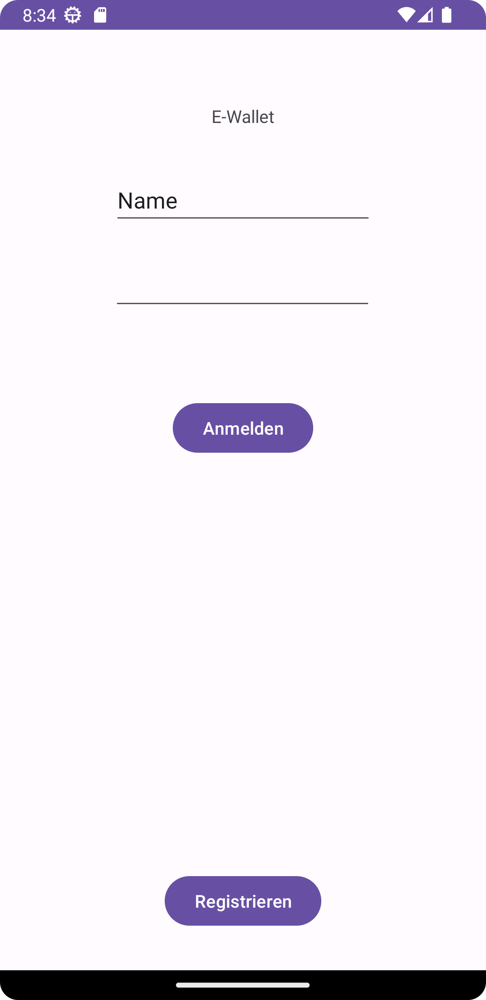
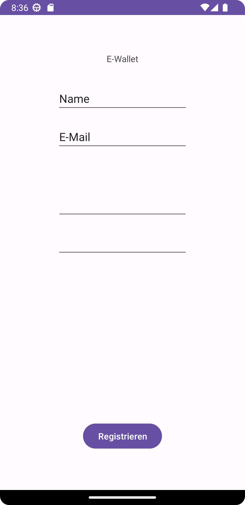
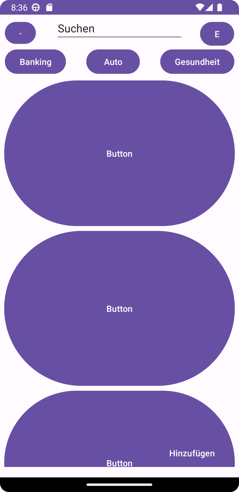
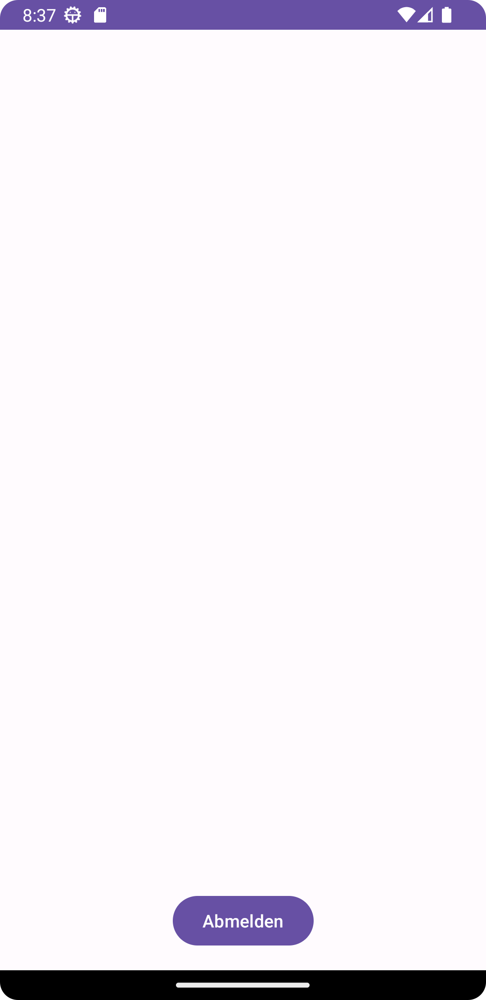
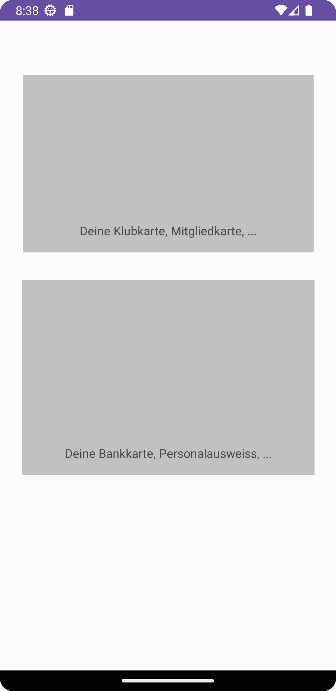
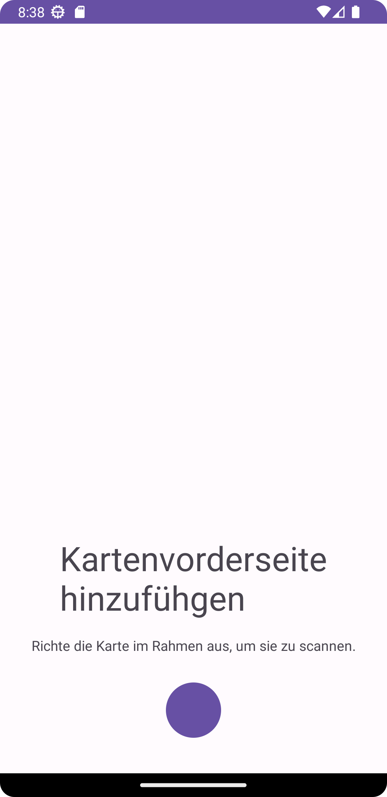
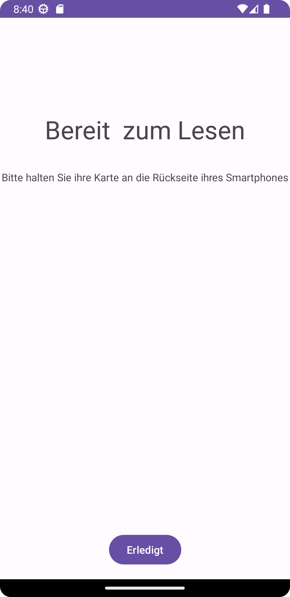
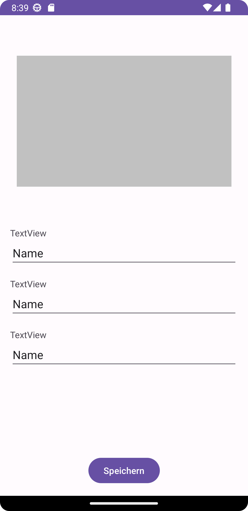

# Login

# Register

# Home

Auf der Home Activity werden alle verfügbaren Karten groß untereinander angezeigt.
Es ist möglich mit der Filterfunktion direkt nach Karten vom Typ "Banking", "Auto" oder "Gesundheit" zu suchen. Es ist auch möglich mit der "Suchen" Funktion nach beliebigen Karten zu suchen.

Oben rechts mit dem "E" (Einstellungs) -Button ist es möglich zu der Einstellungen-Activity zu kommen.

Unten rechts mit dem "Hinzufügen"-Button ist es möglich zu der Activity "Add Card Selection" zu kommen.

# Settings

# Add Card Selection

# Add Card Camera Front

# Add Card Camera Back

# NFC Ready to Read
Screen mit Text "Bereit zum Lesen. Bitte halten Sie ihre Karte an die Rückseite ihres Smartphones." Sobald eine NFC-fähige Karte erkannt wird, wird zum "NFC Reading"-Screen gewechselt.  

# NFC Reading
Screen mit Wartesymbol und einem "Erledigt"-Button als Platzhalter bis die NFC Funktion implementiert ist.

# Card View To Save
Zu speichernde Kartenübersicht mit Bild der Karte und verschiedenen vorausgefüllten Textfeldern. Diese sollen mit dem "Speichern"-Button in die Datenbank hinzugefügt werden.

